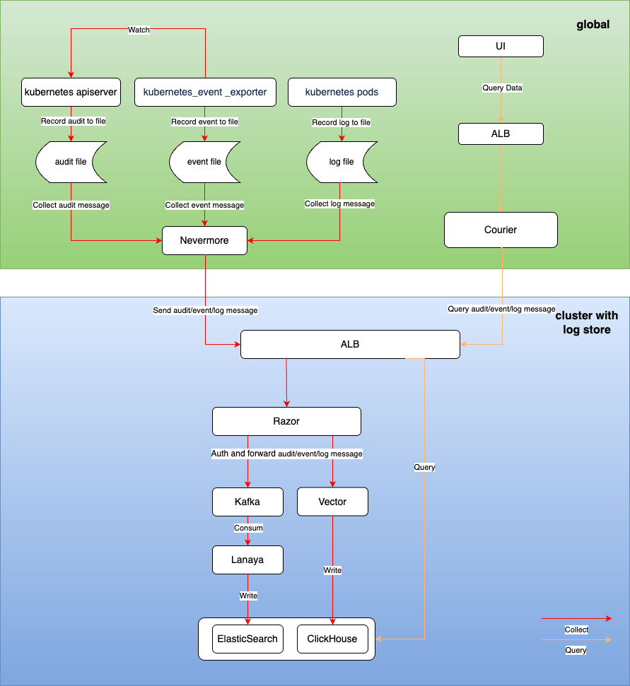

# Log Module Architecture

## Log Collection

- Marketplace - Cluster Plugins - Alauda Container Platform Log Collector enables the log collection component. The log types include: Audit, Events, Kubernetes logs, Product logs, System logs, and Application logs.
- The Nevermore pod runs multiple containers (audit, events, log, node-problem-detector) responsible for collecting different types of logs. By entering the corresponding container, executing `ps -ef` allows viewing the loaded configuration files.
- Kubernetes-event-exporter is responsible for monitoring events generated by kube-apiserver and writing them to the local disk file `/cpaas/event/events.log`, which is then collected by Nevermore.

## Log Storage

- Nevermore collects logs from `/cpaas/{log,audit,event}` and sends them to the ALB of the corresponding log storage cluster. (1) If logs are stored within the same cluster, data is sent via the razor service, using the path `http://razor:8080/v4/callback`; (2) If logs from a business cluster are stored in the global cluster, they are sent to razor using the platform access address, with the path `https://<platform_access_address>/v4/callback`; (3) If logs are stored in another business cluster, they are sent to razor through that cluster's ALB on port 11780, using the path `http://alb:11780/v4/callback`. (The destination address for Nevermore to send logs to razor can be queried using `kubectl get cm -n cpaas-system nevermore-config -oyaml`).
- If Elasticsearch is deployed in the log storage cluster, razor writes the received logs to Kafka. The `ALAUDA_AUDIT_TOPIC` stores audit logs, `ALAUDA_EVENT_TOPIC` stores event logs, and `ALAUDA_LOG_TOPIC` stores Kubernetes logs, product logs, system logs, and application logs. Lanaya consumes logs from Kafka and writes them to Elasticsearch.
- If ClickHouse is deployed in the log storage cluster, dependencies on Kafka, Zookeeper, Lanaya, and Razor are removed. Vector is introduced as a log aggregator to write directly to ClickHouse, reducing the load on ClickHouse.

## Log Query

- The product UI interface queries logs via the following URLs (Log Query: `/platform/logging.alauda.io/v2`, Event Query: `/platform/events.alauda.io/v1`, Audit Query: `/platform/audits.alauda.io/v1`).
- The ALB invokes the `courier-api` component in the global cluster (if the log storage plugin is deployed in a business cluster, the `courier-api` component runs in the global cluster) to query logs from the log storage cluster's Elasticsearch or ClickHouse and returns the results to the front end. (The courier-api's YAML does not contain the Elasticsearch request address; this is recorded in the `feature` resource of `log-center` and is loaded by retrieving the feature after startup).
