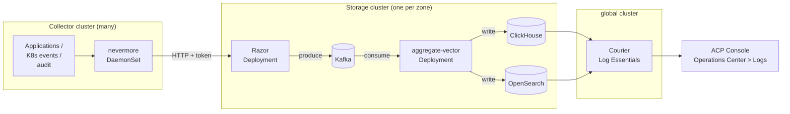

# Log Module Architecture

## Overview

The Logging module has three responsibilities:

1. **Log collection** — read logs, events, and audit records on every collector node.
2. **Log storage** — persist those records into a scalable backend (ClickHouse or OpenSearch, recommended in ACP 4.4; Elasticsearch retained for legacy).
3. **Log query and visualization** — serve queries from the ACP console over the stored data.

ACP 4.4 splits these responsibilities across four cluster plugins (see [Installation](../install/index.mdx)) that talk to two external systems that the SRE prepares before install: a Kafka cluster and either a ClickHouse or an OpenSearch cluster.

```mermaid
flowchart LR
    subgraph collector["Collector cluster (many)"]
      A[Applications /<br/>K8s events /<br/>audit] --> B[nevermore<br/>DaemonSet]
    end
    subgraph storage["Storage cluster (one per zone)"]
      B -->|HTTP + token| C[Razor<br/>Deployment]
      C -->|produce| K[(Kafka)]
      K -->|consume| V[aggregate-vector<br/>Deployment]
      V -->|write| S1[(ClickHouse)]
      V -->|write| S2[(OpenSearch)]
    end
    subgraph global["global cluster"]
      Q[Courier<br/>Log Essentials]
    end
    S1 --> Q
    S2 --> Q
    Q --> UI[ACP Console<br/>Operations Center &gt; Logs]
```

`log-storage-operator` reconciles the storage-side workloads (`Razor`, `aggregate-vector`, one-shot `schema-migrations` Job, side resources) from a single `PlatformLogForward/platform-default` CR. The SRE never applies Razor or aggregate-vector Deployments by hand.

## Log Collection

### Component footprint

**`nevermore`** is installed as a DaemonSet in the `cpaas-system` namespace of every collector cluster. Each pod contains four containers:

| Container | Function |
| --- | --- |
| `audit` | Collects audit data from `/var/log/kubernetes/audit` (path may vary). |
| `event` | Watches the Kubernetes event stream. |
| `log` | Collects standard-output and file logs. Runs Vector as its data path engine. |
| `node-problem-detector` | Collects node-level abnormality signals. |

### Data flow

Each container writes into an in-pod queue that Vector reads. Vector applies path-based routing, adds cluster / namespace / pod metadata, and pushes to the storage cluster's Razor endpoint over HTTP with a callback token.

## Log Ingest and Buffering

### Razor

Razor is the storage-side HTTP endpoint. It authenticates every request against the platform's token service and, on success, produces the record into the matching Kafka topic (`ALAUDA_LOG_TOPIC`, `ALAUDA_EVENT_TOPIC`, or `ALAUDA_AUDIT_TOPIC`).

In ACP 4.4 Razor is a stateless Deployment. Earlier releases ran it as a StatefulSet with a per-pod Vector sidecar; that layout is gone.

### Kafka

Kafka buffers records between Razor and the storage backend. Both ClickHouse and OpenSearch backends require it. ACP 4.4 uses Kafka in KRaft mode, so no Zookeeper is deployed.

The SRE owns the Kafka cluster, the SASL account, the three topics, and their ACLs. `log-storage-operator` verifies that all four are present before it lets `aggregate-vector` and `Razor` roll out. See [Installation §1.1.1](../install/index.mdx#111-kafka) for the exact requirements.

## Log Storage

### aggregate-vector

`aggregate-vector` is a Vector Deployment that consumes from the three Kafka topics, applies Vector Remap Language (VRL) transforms to reshape records for the chosen backend, and writes into ClickHouse or OpenSearch. It replaces the per-pod Vector sidecar used in ACP 4.3 for ClickHouse and takes over the ingest role that Lanaya used to play for Elasticsearch.

The VRL transforms and sink parameters are derived by `log-storage-operator` from the `PlatformLogForward` spec. Operators can tune batching, retry, and backpressure knobs through the PLF or through user-managed overrides; see [Environment Preparation](../prepare/index.mdx) for the SRE-facing configuration surface.

### ClickHouse

When `PlatformLogForward.spec.externalStorage.type` is `clickhouse`, `aggregate-vector` writes into the ClickHouse `observability` database (default name) through the HTTP interface. Table layout is provisioned by the one-shot `schema-migrations` Job that `log-storage-operator` derives from the PLF; per-log-type TTLs and tiered-storage policies land in the same Job.

### OpenSearch

When `PlatformLogForward.spec.externalStorage.type` is `opensearch`, `aggregate-vector` writes into rolling indices per log type. Composable templates and ISM policies are provisioned by an OpenSearch-specific one-shot Job.

### Elasticsearch (legacy)

The Elasticsearch storage plugin remains available for existing customers. Its pipeline (Filebeat → Kafka → Lanaya → Elasticsearch) is unchanged; do not mix a Fresh `PlatformLogForward` on top of it. See [Upgrade](../upgrade/index.mdx) and [Migration](../migration/index.mdx) if you plan to move an Elasticsearch installation onto ClickHouse or OpenSearch.

## Log Visualization

The ACP console reads through the query APIs published by **Alauda Container Platform Log Essentials** on the `global` cluster:

| Query type | API path |
| --- | --- |
| Log query | `/platform/logging.alauda.io/v2/logs` |
| Event query | `/platform/events.alauda.io/v1` |
| Audit query | `/platform/audits.alauda.io/v1` |

Courier (Log Essentials) receives the request, picks the storage cluster from the request, and forwards the query to that cluster's Razor. Razor executes it against the local ClickHouse or OpenSearch endpoint and returns the results.
