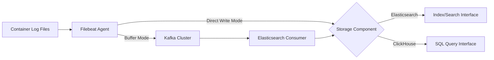

# Concepts

## Open Source Components

### Filebeat

**Positioning**: Lightweight log collector
**Description**: An open-source log collection component installed on container nodes, responsible for real-time monitoring of log files at specified paths. It collects log data through input modules, processes it, and forwards the logs to Kafka or directly delivers them to storage components via output modules. It supports capabilities such as multiline log aggregation and field filtering for preprocessing.

### Elasticsearch

**Positioning**: Distributed search and analytics engine\
**Description**: A full-text search engine based on Lucene, storing log data in JSON document format, and providing near real-time search capabilities. It supports dynamic mapping for automatic field type recognition and achieves fast keyword searches through inverted indexing, suitable for log searches and monitoring alerts.

### ClickHouse

**Positioning**: Columnar analytical database\
**Description**: High-performance columnar storage database designed for OLAP scenarios, implementing PB-level log data storage using the MergeTree engine. It supports high-speed aggregation queries, time partitioning, and data TTL strategies, making it suitable for log analysis and statistical reporting in batch computation scenarios.

### Kafka

**Positioning**: Distributed message queue\
**Description**: Serving as the messaging middleware for the log pipeline system, it provides high-throughput log buffering capabilities. When the Elasticsearch cluster experiences processing bottlenecks, it receives log data sent by Filebeat via Topics, facilitating traffic peak reduction and asynchronous consumption, ensuring the stability of the log collection end.

## Core Functionality Concepts

### Log Collection Pipeline

**Description**: The complete link from log data generation to storage, comprising four stages: `Collection -> Transmission -> Buffering -> Storage`. It supports two pipeline modes:

- **Direct Write Mode**: Filebeat → Elasticsearch/ClickHouse
- **Buffer Mode**: Filebeat → Kafka → Elasticsearch

### Index

**Description**: The logical data partitioning unit in Elasticsearch, analogous to a table structure in databases. It supports time-based rolling index creation (e.g., logstash-2023.10.01) and automated hot-warm-cold tiered storage via Index Lifecycle Management (ILM).

### Shards and Replicas

**Description**:

- **Shard**: The physical storage unit resulting from Elasticsearch's horizontal splitting of an index, supporting distributed scalability.
- **Replica**: A copy of each shard, providing data high availability and query load balancing.

### Columnar Storage

**Description**: The core storage mechanism of ClickHouse, where data is compressed and stored by column, significantly reducing I/O consumption. It supports the following features:

- Vectorized query execution engine
- Data partitioning and sharding
- Materialized views for pre-aggregation

## Key Technical Terms

### Ingest Pipeline

**Description**: The data preprocessing pipeline in Elasticsearch, capable of performing ETL operations such as field renaming, Grok parsing, and conditional logic before data is written.

### Consumer Group

**Description**: Kafka's parallel consumption mechanism, where multiple instances within the same consumer group can consume messages from different partitions in parallel, ensuring ordered message processing.

### TTL (Time To Live)

**Description**: Data lifespan strategy, supporting two implementation methods:

- Elasticsearch: Automatically deletes expired indices through ILM policies.
- ClickHouse: Automatically deletes table partitions via TTL expressions.

### Replication Factor

**Description**: The data redundancy configuration at the Kafka Topic level, defining the number of message replicas across different Brokers, enhancing data reliability.

## Data Flow Model

