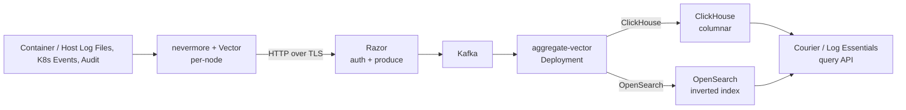

# Concepts

## Open Source Components

### nevermore

**Positioning**: Node-level log collector
**Description**: A DaemonSet that runs on every node in a collector cluster. `nevermore` reads standard-output logs from containers, file logs from configured host paths, Kubernetes events, and audit records; enriches them with cluster / namespace / pod metadata; and forwards them to the storage cluster over HTTP. Internally, `nevermore` uses [Vector](https://vector.dev/) as its data path engine. It replaces Filebeat, which was the collector used in ACP 4.3 and earlier.

### Vector

**Positioning**: High-performance observability data pipeline
**Description**: A single-binary agent used by ACP Logging in two distinct roles:

- Inside every `nevermore` pod on a collector cluster, as the local pipeline that watches log files, applies transformations, and pushes to the storage cluster.
- As a **Deployment** named `aggregate-vector` on every storage cluster, where it consumes from Kafka, applies routing / reshaping (Vector Remap Language, VRL), and writes to ClickHouse or OpenSearch.

### Kafka

**Positioning**: Distributed message queue
**Description**: The buffering layer between the collector and the storage backend. Kafka receives records from Razor and holds them until `aggregate-vector` consumes them. This decouples spikes on the ingest side from the write throughput of the storage backend and lets the collector keep advancing while the backend recovers. ACP 4.4 uses Kafka in KRaft mode; no Zookeeper is required.

### ClickHouse

**Positioning**: Columnar analytical database
**Description**: A high-performance columnar storage database designed for OLAP scenarios, storing log data with the MergeTree engine. Supports high-speed aggregation queries, time partitioning, TTL-based lifecycle, and S3-backed storage placement. Recommended for large log volume and cost-sensitive retention.

### OpenSearch

**Positioning**: Distributed search and analytics engine
**Description**: An open-source distributed search engine and analytics suite forked from Elasticsearch, using an inverted index for near-real-time keyword search over log data. Introduced as a first-class storage backend in ACP 4.4. Recommended when the search experience (Lucene-style DSL, keyword highlighting, faceted queries) matters more than raw ingest throughput.

### Elasticsearch

**Positioning**: Distributed search and analytics engine (legacy backend)
**Description**: The original Lucene-based backend used by ACP Logging in earlier releases. Retained for existing customers upgrading from ACP 4.2 or 4.3 and remains fully supported through the Elasticsearch storage plugin. New installations should choose ClickHouse or OpenSearch.

## ACP Logging Components

### log-storage-operator

**Positioning**: Kubernetes operator that runs the storage-side data path
**Description**: Installed by **Alauda Container Platform Log Storage for ClickHouse** or **for OpenSearch**. Watches `PlatformLogForward` and derives everything the storage side needs: the `aggregate-vector` Deployment, the `razor` Deployment, the one-shot `schema-migrations` Job, RBAC, and side resources (Feature/log-center, log policy ConfigMaps). SRE builds the external ClickHouse / OpenSearch / Kafka cluster; the operator only consumes their endpoints through the connection Secrets.

### Razor

**Positioning**: Log ingest and authentication service
**Description**: The storage-side HTTP endpoint that `nevermore` pushes to. Razor authenticates every request against the platform, then produces the records into Kafka. Deployed as a stateless Deployment in ACP 4.4 (was a StatefulSet with a Vector sidecar in earlier releases). Also serves as the query proxy that reads from ClickHouse for the platform's log query APIs.

### aggregate-vector

**Positioning**: Kafka-to-storage sink Deployment
**Description**: The Vector Deployment that consumes from the three Kafka topics (`ALAUDA_LOG_TOPIC`, `ALAUDA_EVENT_TOPIC`, `ALAUDA_AUDIT_TOPIC`), applies VRL transforms to shape records for the chosen backend, and writes into ClickHouse or OpenSearch. Replaces the per-pod Vector sidecar used in ACP 4.3 for ClickHouse and takes over the role that Lanaya used to play for Elasticsearch.

### Courier

**Positioning**: Log query API
**Description**: The **Alauda Container Platform Log Essentials** plugin publishes Courier on the `global` cluster. Courier fronts the log, event, and audit query endpoints used by the ACP console and routes the underlying queries to the appropriate storage cluster.

## Custom Resources

### PlatformLogForward (PLF)

**Description**: The cluster-scoped CR that describes the storage side of a Logging installation. Always named `platform-default`; there is exactly one per storage cluster. Its `spec.externalStorage` names the ClickHouse or OpenSearch endpoint (via a connection Secret), `spec.externalMessageQueue` names the Kafka endpoint (via a connection Secret), and optional fields cover retention (`spec.clickhouse.ttl`), tiered storage (`spec.clickhouse.tieredPolicy` / `spec.clickhouse.coldTTL`), and component sizing (`spec.aggregateVector.replicas`, `spec.razor.replicas`). `log-storage-operator` watches this CR and builds the storage-side workloads from it.

### LogForward (LF)

**Description**: A namespace-scoped CR that lets tenants forward their own log stream to an external endpoint (syslog, HTTP, or Kafka), independently of the platform's built-in storage plugin. Each `LogForward` describes an input filter (namespace / workload / log type) and one or more output sinks. `log-storage-operator` renders the CR into a dedicated Vector Deployment per LogForward.

## Core Functionality Concepts

### Log Collection Pipeline

**Description**: The complete link from log data generation to storage, with three stages: `Collection → Ingest & Buffering → Storage`.

- **Collection**: `nevermore` on every collector node reads container logs, host files, events, and audit records.
- **Ingest & Buffering**: `nevermore` pushes to Razor over HTTP; Razor authenticates and produces into Kafka.
- **Storage**: `aggregate-vector` consumes from Kafka and writes into ClickHouse or OpenSearch.

The Kafka buffer is mandatory in ACP 4.4 for both backends; the direct-write and buffer-mode split from earlier releases no longer applies.

### Index (OpenSearch / Elasticsearch)

**Description**: The logical data partitioning unit in OpenSearch and Elasticsearch, analogous to a table in a relational database. Supports time-based rolling index creation (for example `log-workload-2026.03.05`) and automated tiered lifecycle via Index State Management (ISM) on OpenSearch or Index Lifecycle Management (ILM) on Elasticsearch.

### Shards and Replicas

**Description**:

- **Shard**: The physical storage unit resulting from horizontal splitting of an index (OpenSearch / Elasticsearch) or a table (ClickHouse), supporting distributed scalability.
- **Replica**: A copy of each shard, providing high availability and query load balancing.

### Columnar Storage (ClickHouse)

**Description**: The core storage mechanism of ClickHouse, where data is compressed and stored by column, significantly reducing I/O consumption. Supports:

- Vectorized query execution engine
- Data partitioning and sharding
- Materialized views for pre-aggregation

### Storage Policy (ClickHouse)

**Description**: The ClickHouse storage placement model that controls where table data lives. In ACP Logging, ClickHouse supports:

- **Default**: Table data on local host paths or a StorageClass.
- **Hot and cold separation**: Recent data on local storage, cold data on S3. Configured on the `PlatformLogForward` through `spec.clickhouse.tieredPolicy`, `spec.clickhouse.coldTTL`, and `spec.clickhouse.s3ColdSecretRef`.

### Hot and Cold Separation

**Description**: A tiered storage model for ClickHouse. Records stay on local disk while active; once the hot TTL elapses they are moved to S3 and remain queryable until the cold TTL removes them. Enable per-log-type in the PLF.

## Key Technical Terms

### Consumer Group

**Description**: Kafka's parallel consumption mechanism. Multiple instances within the same consumer group can consume messages from different partitions in parallel. ACP Logging uses three consumer groups — `alauda_log`, `alauda_event`, `alauda_audit` — one per Kafka topic.

### TTL (Time To Live)

**Description**: Data lifespan strategy, implemented per backend:

- ClickHouse: `TTL` expression at table level; deletes expired rows or moves them to cold storage.
- OpenSearch / Elasticsearch: Index-level policy (ISM / ILM); deletes expired indices.

### Replication Factor

**Description**: The data redundancy configuration at the Kafka topic level, defining the number of message replicas across different brokers.

## Data Flow Model

```mermaid
graph LR
    A[Container / Host Log Files, K8s Events, Audit] --> B[nevermore + Vector<br/>per-node]
    B -->|HTTP over TLS| C[Razor<br/>auth + produce]
    C --> D[Kafka]
    D --> E[aggregate-vector<br/>Deployment]
    E -->|ClickHouse| F[ClickHouse<br/>columnar]
    E -->|OpenSearch| G[OpenSearch<br/>inverted index]
    F --> H[Courier / Log Essentials<br/>query API]
    G --> H
```
